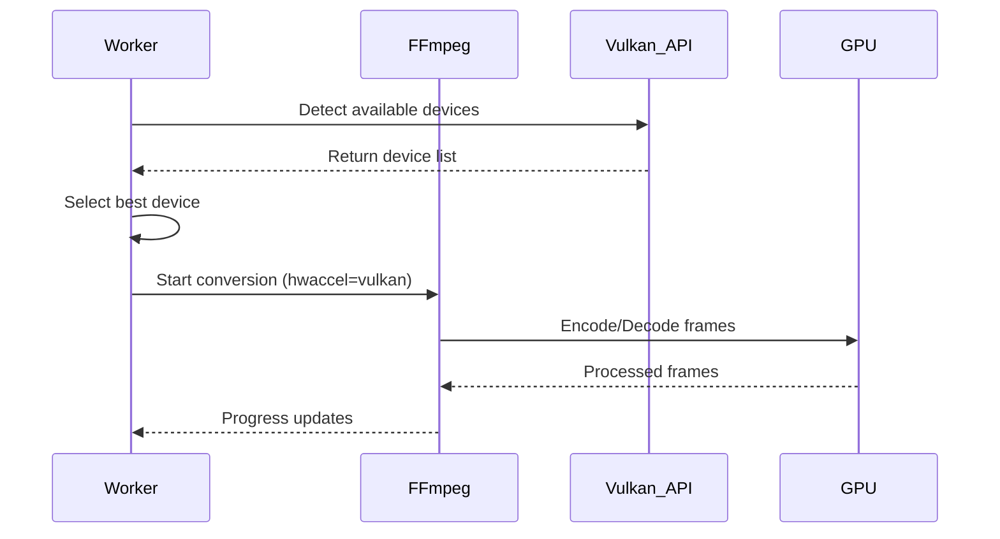

# DarkStream Architecture

This document provides a detailed overview of the component interaction and data flow within the DarkStream distributed video conversion system.

## System Components

DarkStream consists of three primary services:
1. **video-converter-master**: The central coordinator and API server. It also serves the Web UI dashboard on its root URL.
2. **video-converter-worker**: The compute node that performs video conversions.
3. **video-converter-cli**: A command-line tool for monitoring and management.

### Component Interaction Diagram

```mermaid
graph TD
    subgraph Master Node
        M[Master API Server]
        Q[(SQLite DB / Queue)]
        S[File Scanner]
    end

    subgraph Worker Nodes
        W1[Worker 1]
        W2[Worker 2]
    end

    subgraph Storage
        SRC[Source Videos]
        DST[Converted Videos]
    end

    subgraph Monitoring
        CLI[CLI Tool]
        UI[Web Dashboard]
    end

    %% Master interactions
    S -->|Finds videos| Q
    S -->|Reads| SRC
    M <-->|Reads/Updates jobs| Q

    %% Worker interactions
    W1 <-->|1. Fetch config| M
    W1 <-->|2. Get next job| M
    W1 <-->|3. Download source (HTTP)| M
    W1 <-->|4. Report progress| M
    W1 <-->|5. Upload result (HTTP)| M
    W1 -->|6. Job complete/failed| M

    W2 <-->|API Polling| M

    %% Monitoring interactions
    CLI <-->|Query status| M
    UI <-->|Fetch metrics| M
```

## Data Flow: Job Lifecycle

1. **Initialization**: When a worker starts, it connects to the master and dynamically fetches its configuration, including rate limits, timeouts, and default conversion parameters (resolution, bitrate, etc.).
2. **Discovery**: The `Scanner` component in the master node periodically scans the configured source directory (`/mnt/storage/videos`) for valid video files. When a new file is found, it is added to the SQLite database as a `pending` job.
3. **Polling**: Workers periodically poll the master node via the `/api/worker/next-job` endpoint to request work.
4. **Assignment**: If a `pending` job exists, the master updates its status to `processing` and assigns it to the requesting worker.
5. **Execution**:
   - The worker downloads the source video directly from the master via HTTP.
   - The worker identifies the best available Vulkan-compatible GPU for processing.
   - FFmpeg is invoked by the worker to convert the video using parameters fetched from the master.
   - During conversion, the worker periodically sends progress updates to the master via `/api/worker/job-progress`.
6. **Completion**:
   - Upon successful conversion, the worker uploads the output file to the master via HTTP.
   - The worker sends a `/api/worker/job-complete` request to the master.
   - The master marks the job as `completed` in the database.
7. **Failure Recovery**:
   - If a conversion fails, the worker sends a `/api/worker/job-failed` request.
   - The master tracks the failure count. If it exceeds the maximum retries, the job is marked `failed`. Otherwise, it returns to `pending`.
   - If a worker stops sending heartbeats while processing a job, the master will eventually time out the job and return it to the queue.

## Hardware Acceleration (Vulkan)

Workers utilize Vulkan for hardware acceleration, enabling cross-platform, vendor-agnostic GPU usage for video encoding and decoding. The worker module dynamically detects Vulkan devices upon startup.


